<div align="center">
  
  <h1>Kavranta</h1>
  <p><strong>One place for every <code>.env</code> file your project already uses.</strong></p>
  <p>Edit, link, share, and deploy environment variables—without changing your runtime or pasting protected values into AI chat.</p>
  <p><a href="README.md">English</a> · <a href="README.ko.md">한국어</a></p>
  <p>
    <a href="https://github.com/haechan1103/kavranta/releases/latest"></a>
    <a href="https://github.com/haechan1103/kavranta/actions/workflows/ci.yml"></a>
    <a href="LICENSE"></a>
    
    
  </p>
</div>

## Start here

On macOS:

```bash
brew install --cask haechan1103/tap/kavranta
```

Or [download an installer](https://github.com/haechan1103/kavranta/releases/latest).
macOS builds are signed and notarized. Windows is an **unsigned x64 beta**; read
the [first-launch notes](#windows-first-launch) before installing.

### Your first useful task

1. Open Kavranta and choose your existing project folder. Registration discovers
   supported files without changing them.
2. Open a file, turn on **Missing values only**, and fill one empty variable. If all
   values are present, review an existing variable instead.
3. Check which files Save will affect, then save when ready. Keep using your normal
   development command. Same-name variables are independent unless you link them.

Connecting an AI agent is optional. No hosted account or new runtime is required
for local editing. If no files appear, follow the project's setup guide and refresh;
example/template files are intentionally excluded and are not copied automatically.

[90-day roadmap and next fixes](ROADMAP.md) ·
[Try the interactive sample](https://haechan1103.github.io/kavranta/) ·
[Tell us where you got stuck](https://github.com/haechan1103/kavranta/discussions)

<details>
  <summary>Watch the broader workflow (synthetic data)</summary>

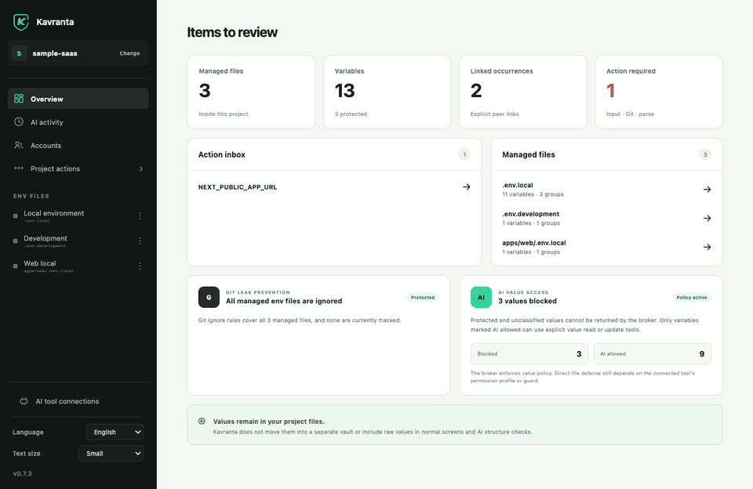

</details>

<div align="center">
  <a href="https://github.com/haechan1103/kavranta/releases/latest"><strong>Download for macOS or Windows</strong></a>
  ·
  <a href="#connect-your-ai-coding-agent">Connect an AI agent</a>
  ·
  <a href="SECURITY.md">Security model</a>
</div>

> Kavranta was previously published as **Env Manager**. Existing app data and project
> formats remain compatible. New agent installations use `kavranta`; the app handles
> migration from its older managed connection configuration.

Kavranta is a local-first desktop app. Register a project and it discovers the real `.env`, `.env.local`, `.env.development`, `runtime.env`, Wrangler `.dev.vars`, and nested app env files already used by that project. Environment values stay in those files. Reusable sign-in details are optional and stay in the operating system's secure store—Kavranta does not require a hosted vault or a new runtime command.

## Why use it?

| Keep your current workflow | Update linked values once | Work with AI more safely |
| --- | --- | --- |
| Your existing files and commands remain authoritative. Kavranta preserves paths, comments, ordering, and unrelated formatting. | Explicitly link the same key across two, three, or more files. Edit from any member and save every linked occurrence together. | Codex, Claude Code, Copilot, Cursor, and OpenCode can inspect structure and perform approved operations through a redacted local broker. Protected values stay out of normal inspection responses. |
| **Share without committing env files** | **Deploy only what you select** | **Catch Git mistakes early** |
| Export all or selected variables as a passphrase-encrypted package, or publish immutable packages through a mounted team folder. | Send selected values to GitHub Actions, Cloudflare Workers, Expo EAS, AWS, or a locally installed CLI Pack without creating a temporary env file. | Detect missing ignore rules, already tracked env files, historical paths, and suspicious public frontend variable names. |
| **Finish incomplete setup faster** | **Keep reusable accounts out of project files** | **Grant access per project** |
| Filter an env file to only variables that still need a value, with the remaining count visible at a glance. | Store optional usernames and passwords in Apple Keychain or Windows Credential Manager instead of `.env`, Git, or Kavranta's local metadata. | New accounts start blocked. Explicitly allow or revoke each project; a grant never lets an AI agent run a login on its own. |

## See the workflow

### Included in the 0.7.6 release

Project-wide metadata search, direct navigation to a missing variable, and combined
name/missing-value filters are implemented in this source tree. Search does not
inspect values, and changing filters preserves unsaved drafts. The separate
[website](https://haechan1103.github.io/kavranta/) includes an EN/KO sample-linking
playground hosted as static assets on GitHub Pages.
See [ROADMAP.md](ROADMAP.md) for verification gates and work still outstanding.

### Organize real env files, not copies

Projects and files can have local display names while their physical paths remain visible and unchanged. Values are masked by default; variable names can be copied, groups can be jumped to quickly, and linked rows show every file affected by Save.

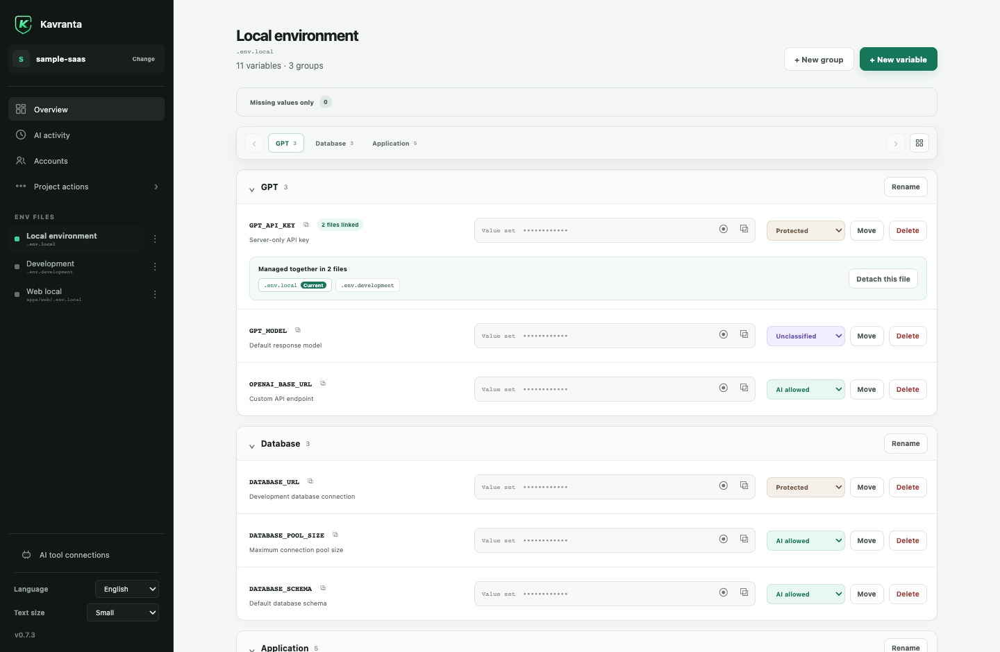

### Know what needs attention

The project overview combines missing values, parse warnings, Git leak checks, and
managed-file navigation without reading values for those checks. AI policy stays in
the owning variable row. Inside a file, turn on **Missing values only** to focus on
unfinished setup.

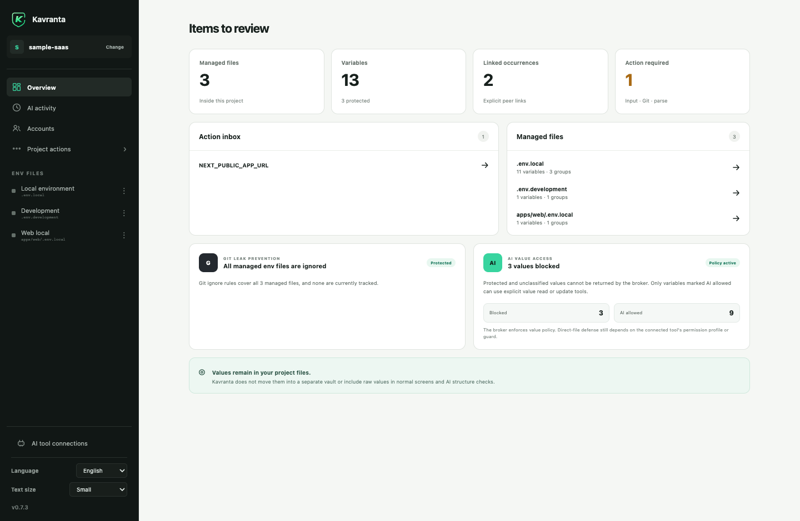

### Reuse an account without putting it in `.env`

The optional Accounts screen stores usernames and passwords in Apple Keychain or Windows Credential Manager. Kavranta keeps only non-secret labels and project grants in its local app data. Every new account is blocked from all projects until you explicitly allow one.

An allowed project may copy a field on your direct desktop action; Kavranta clears an unchanged clipboard after 45 seconds. Project access does not authorize an AI agent to retrieve credentials or run a login test, and this feature is not browser autofill, cloud sync, or a replacement for an organization password manager.

### Share the whole setup—or only the part a teammate needs

<table>
  <tr>
    <td width="50%"><strong>Select files and variables</strong><br />Linked occurrences are selected together. Encrypted export never writes an intermediate plaintext ZIP.</td>
    <td width="50%"><strong>Use a folder your team already has</strong><br />A mounted NAS or sync folder stores ciphertext packages only. Existing folder permissions remain authoritative.</td>
  </tr>
  <tr>
    <td>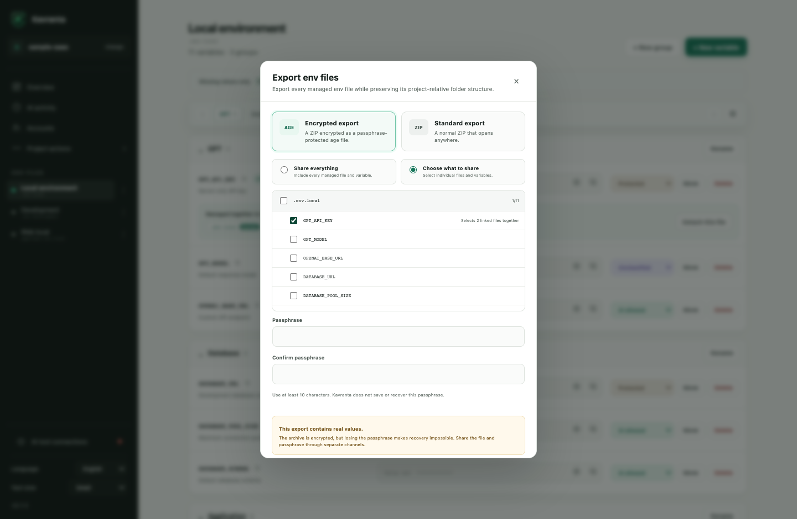</td>
    <td>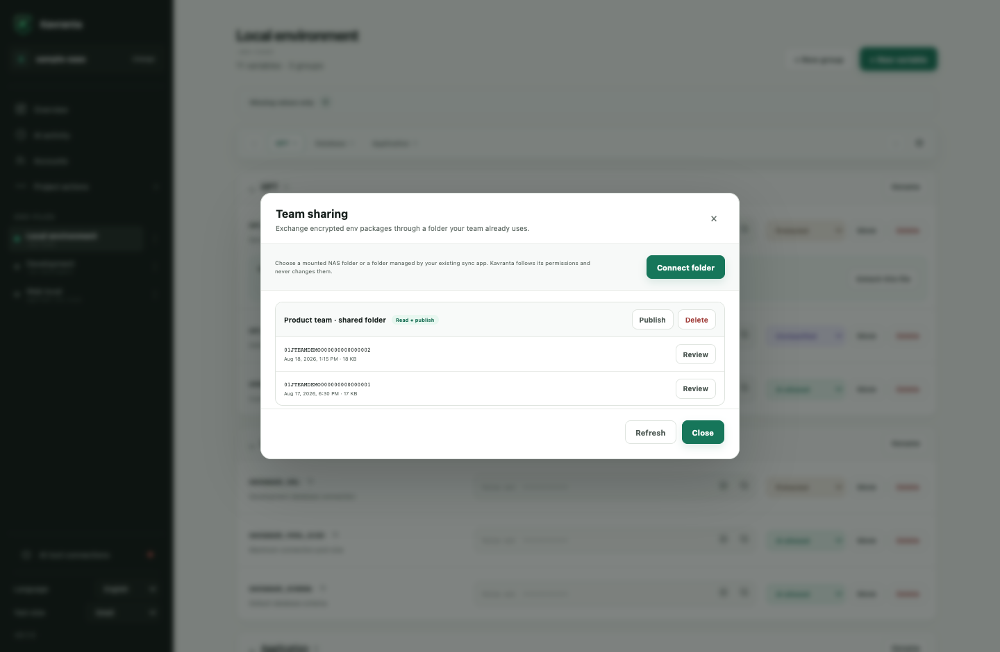</td>
  </tr>
</table>

Imports add missing variables, preserve receiver-only content, and make differing values explicit. Keep-local is the default; each unlinked conflict is independent, while an existing linked group stays one atomic choice.

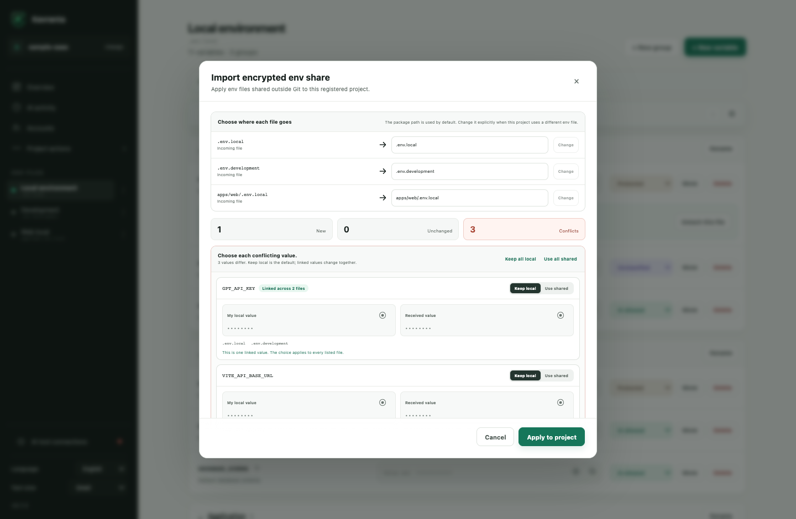

### Push selected values, then verify where verification is possible

<table>
  <tr>
    <td width="50%"><strong>Cloudflare Workers</strong><br />Detect the nearest Wrangler config, verify login/account/Worker access, and send selected Worker Secrets through stdin.</td>
    <td width="50%"><strong>AWS Secrets Manager and SSM</strong><br />Use the local AWS profile or SSO chain, verify account and Region, select KMS, and check equality without displaying values.</td>
  </tr>
  <tr>
    <td>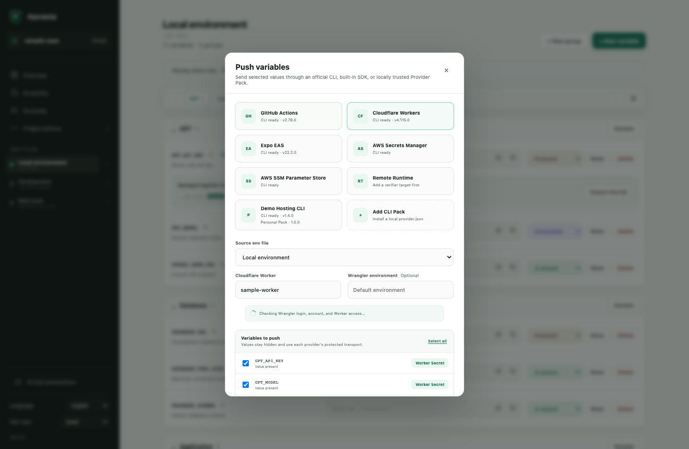</td>
    <td>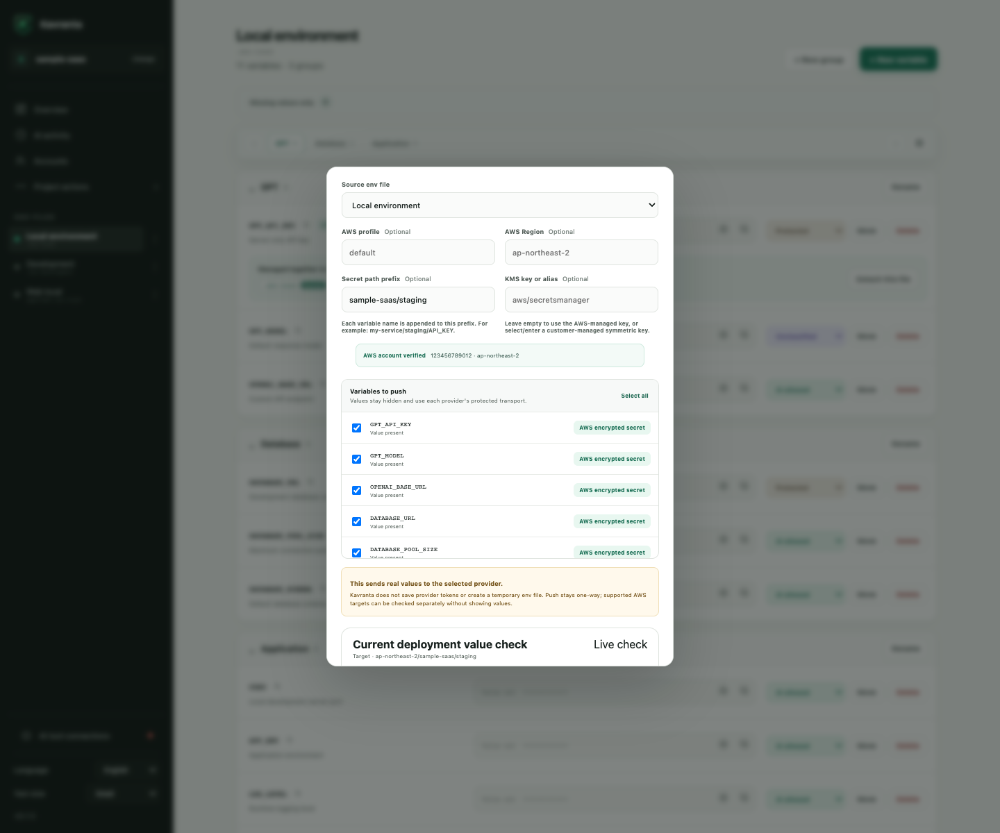</td>
  </tr>
</table>

For a server env file outside a project, an administrator can install the fixed Kavranta Verifier and allowlist a target and variable names. Kavranta sends an age-encrypted stdin frame over SSH and runs only the fixed verifier command.

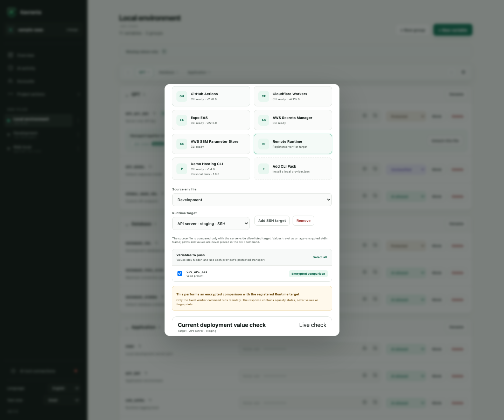

Provider push is always explicit and one-way. GitHub and Cloudflare secret values cannot be read back, so Kavranta does not pretend to verify them. AWS and registered Runtime targets expose a separate comparison operation that returns only equality states. Unselected remote entries are never deleted.

## Supported deployment targets

| Provider | Supported target | How the destination is found |
| --- | --- | --- |
| GitHub Actions | Repository or deployment Environment secrets and configuration variables | Detects the nearest Git worktree and GitHub `origin`, lists accessible repositories and Environments through `gh`, and can explicitly create an Environment. |
| Cloudflare Workers | Worker Secrets for the default Worker or a configured Wrangler environment | Detects the nearest `wrangler.jsonc`, `wrangler.json`, or `wrangler.toml`, then checks the active Wrangler account and Worker access. |
| Expo EAS | Project variables across one or more EAS environments | Detects the nearest `eas.json`, verifies the logged-in project, and sends each value through the EAS CLI hidden prompt instead of `--value`. `EXPO_PUBLIC_` defaults to Sensitive and cannot be EAS Secret. |
| AWS Secrets Manager | One encrypted secret per selected variable | Uses the local AWS profile/SSO credential chain, verifies identity and Region with STS, and supports an optional customer-managed symmetric KMS key. |
| AWS SSM Parameter Store | One `SecureString` parameter per selected variable | Uses the same AWS preflight and optional KMS key, with a configurable path prefix. |
| Remote Runtime | Equality check against one allowlisted server target | Uses a project-shared, value-free target definition and a separately installed fixed SSH Verifier. It does not upload or edit the server file. |
| Personal Provider Pack | A target declared by a locally installed `provider.json` | Runs the declared non-shell executable directly and sends values only through standard input. Packs stay on this computer and can be removed independently. |

Install and sign in to [`gh`](https://cli.github.com/manual/gh_secret_set), [Wrangler](https://developers.cloudflare.com/workers/wrangler/commands/#secret-bulk), or [EAS CLI](https://docs.expo.dev/eas/environment-variables/manage/) before using those providers. AWS uses credentials already configured for the AWS SDK. Review a third-party Provider Pack's manifest and executable before installing it.

## Connect your AI coding agent

One independently versioned local bundle supports **Codex**, **Claude Code**, **GitHub Copilot / VS Code**, **Cursor**, and **OpenCode**. The app detects supported tools and installs or updates their Kavranta configuration. Its single `kavranta-env` Skill recognizes both English and Korean env-management requests, so separate language-specific installations are not required.

<table>
  <tr>
    <td width="50%"><strong>One connection screen</strong><br />See detection, installed bundle version, update state, and active protection layer per tool.</td>
    <td width="50%"><strong>Value-free activity history</strong><br />See broker structure checks, value-read attempts, mutations, provider checks, and allowed/blocked results. Values and value fragments are never logged.</td>
  </tr>
  <tr>
    <td>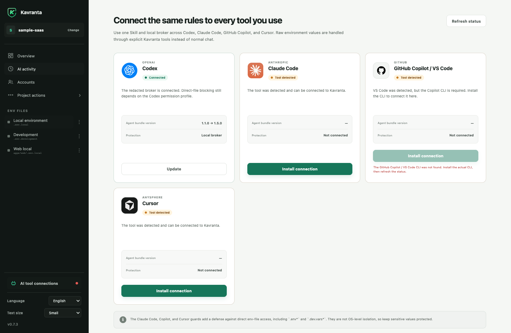</td>
    <td>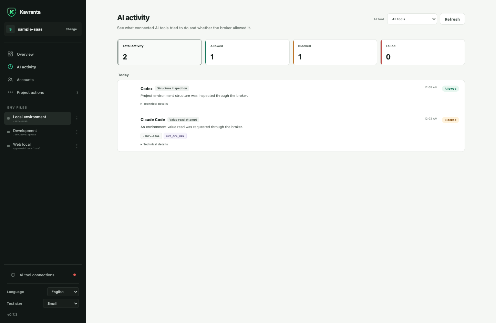</td>
  </tr>
</table>

Host installation notes:

<details>
  <summary><strong>Codex</strong></summary>

```bash
codex plugin marketplace add haechan1103/kavranta
codex plugin add kavranta@kavranta
```
</details>

<details>
  <summary><strong>OpenCode</strong></summary>

Install OpenCode, then choose **Install connection** on Kavranta's AI tools screen.
Kavranta uses OpenCode's global Skill, MCP, and plugin interfaces. The app refuses
to overwrite an unrelated `kavranta` connection or plugin, and reports the
connection as **Configured** until a new OpenCode process loads it. Restart
OpenCode after installation or an update.
</details>

<details>
  <summary><strong>Claude Code</strong></summary>

```bash
claude plugin marketplace add haechan1103/kavranta
claude plugin install kavranta@kavranta
```
</details>

<details>
  <summary><strong>GitHub Copilot CLI / VS Code</strong></summary>

```bash
copilot plugin marketplace add haechan1103/kavranta
copilot plugin install kavranta@kavranta
```
</details>

<details>
  <summary><strong>Cursor</strong></summary>

Install Cursor, then choose **Install connection** on Kavranta's AI tools screen.
Kavranta installs the native plugin under Cursor's documented per-user local plugin
directory. Its fail-closed guards cover Agent tools, Agent context reads, and inline
Tab reads. Run **Developer: Reload Window** in Cursor if it was already open.

Team and Enterprise administrators can disable local plugin imports. A Marketplace
plugin with the same name can also take precedence. Kavranta therefore reports this
as **Configured** rather than claiming Cursor activated it; confirm Kavranta in
Cursor's Customize screen after reload.
</details>

Register the project in Kavranta first, start a new agent session, and ask naturally:

```text
Inspect this project's env structure without reading values.
Create a Database group and add an empty DATABASE_URL variable.
Link GPT_API_KEY across local and development.
Reuse this registered project's GEMINI_API_KEY here without showing it to me.
Find the registered 쏙핀 project and show me its OpenRouter-like variable candidates without reading values.
Push the selected deployment keys to AWS Secrets Manager under my-service/staging without showing their values.
Push EXPO_PUBLIC_KAKAO_NATIVE_APP_KEY to EAS development, preview, and production as Sensitive without showing its value.
Generate AUTH_SECRET with `openssl rand -base64 32` and save it without showing the value.
```

The integration never registers arbitrary projects. Only projects already registered in the desktop app are accepted by the broker.

### AI access policies

| Policy | Agent access |
| --- | --- |
| `protected` | The agent can see the name and whether a value exists; explicit value reads are blocked. |
| `unclassified` | Treated like `protected` until you choose a policy. |
| `read-write` | A dedicated broker value tool may read or update the value when explicitly invoked. |

Normal structure inspection never returns values, including `read-write` values. Internal operations such as linked saves, cross-project copies, provider pushes, redacted comparisons, and a requested one-time stdin generator do not downgrade this policy.

> Kavranta reduces accidental value exposure, but it is not an operating-system sandbox or a production secret manager. Values remain in the original env files. See [SECURITY.md](SECURITY.md) for the complete boundary.

## Install

On macOS, install the signed and notarized app with Homebrew:

```bash
brew install --cask haechan1103/tap/kavranta
```

Homebrew selects the Apple Silicon or Intel DMG for the current Mac. Future releases
can be installed with `brew upgrade --cask haechan1103/tap/kavranta`.

For a manual installation or Windows, download the installer for your computer from
[GitHub Releases](https://github.com/haechan1103/kavranta/releases/latest):

- Windows 10/11 x64 beta (unsigned): `x64-setup.exe`
- Apple Silicon (M1 or newer): `aarch64` DMG
- Intel Mac: `x86_64` DMG

### Windows first launch

The Windows installer is a free **unsigned beta** while the project applies for open-source code signing. Microsoft Defender SmartScreen may show **Windows protected your PC**.

1. Download `x64-setup.exe` only from the [official GitHub Release](https://github.com/haechan1103/kavranta/releases/latest).
2. Open the installer. If SmartScreen appears, select **More info**.
3. Confirm the app name is Kavranta, then select **Run anyway**.

Do not continue if the file came from another site or its details are unexpected. An organization-managed computer may block unsigned applications completely; in that case, contact its administrator instead of bypassing the policy.

### macOS first launch

Starting with `0.6.4`, both macOS DMGs are signed with an Apple Developer ID and contain an app notarized and stapled by Apple before the release is published. macOS may still show the normal confirmation for an app downloaded from the internet; it should identify the developer instead of reporting that Apple cannot verify the app.

If macOS reports an unidentified or unverifiable developer, do not bypass the warning. Confirm that the file came from the [official GitHub Release](https://github.com/haechan1103/kavranta/releases/latest) and report the affected version and Mac architecture.

Kavranta checks one fixed GitHub Releases endpoint for signed app updates. It sends no project path, env metadata, value, or telemetry during the check.

## Develop locally

Requirements: Node.js, npm, Rust 1.85+, and the [Tauri 2 prerequisites](https://v2.tauri.app/start/prerequisites/).

```bash
git clone https://github.com/haechan1103/kavranta.git
cd kavranta
npm install
npm run tauri dev
```

Before opening a pull request:

```bash
npm run check
cargo test --workspace
cargo clippy --workspace --all-targets -- -D warnings
```

Use synthetic env fixtures only. Never commit or attach real `.env*` values. Read [CONTRIBUTING.md](CONTRIBUTING.md) before making a change.

## Project status

Kavranta is an early-stage macOS and Windows desktop project. It ships signed and
notarized macOS builds plus an explicitly unsigned Windows x64 beta. Windows code
signing and Windows ARM64 remain future work. [Releases](https://github.com/haechan1103/kavranta/releases)
describe shipped changes; the [roadmap](ROADMAP.md) separates source work from release
promises. Stable 1.0 depends on compatibility, security, installation, and external
feedback gates—not on a star target.

## Community

Questions and ideas belong in [GitHub Discussions](https://github.com/haechan1103/kavranta/discussions). Bugs and scoped feature requests belong in [Issues](https://github.com/haechan1103/kavranta/issues).

Please follow the [Code of Conduct](CODE_OF_CONDUCT.md). Security reports must use the private process in [SECURITY.md](SECURITY.md).

## License

[MIT](LICENSE)
